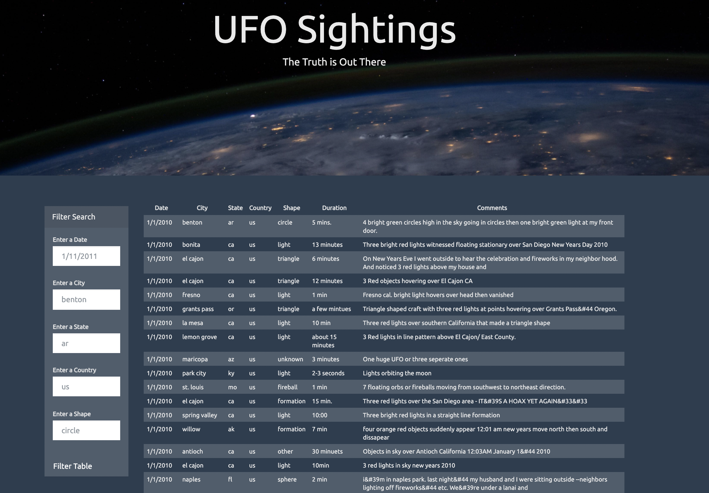

# javascript-challenge

## Description
We have been tasked to write code that will create a dynamic table based on the provided UFO sighting dataset and allow users to filter the table data for specific values.

## How to Run Code
Clone this repository and open the HTML file of your choice. The table containing the dataset should automatically load when the page opens. Use the filter on the left to see the dataset based on specific criteria.

## Results
Here is a preview of what the site looks like:
